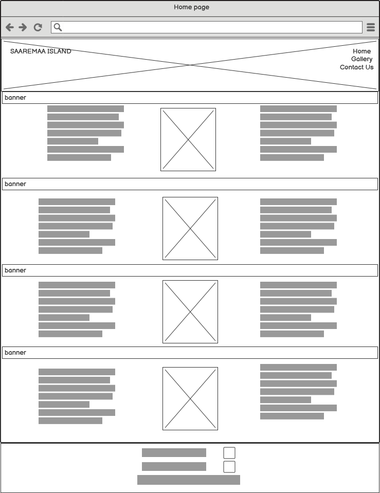
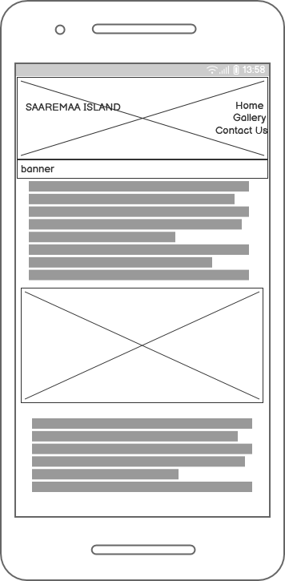

# **Saaremaa**

 By Heli Saarts

##### The website was designed based on the principles taught in the course #####

 ***

## **Introduction** ##

Island Saaremaa is in Baltic sea, part of Estonia

This website is for everybody who likes exploring around, who does not afraid to step out from busy life and find themself in quiet island, meet with local traditions, taste the local food, have a activities indoor and outside, also to take time to take care yourself and spend time in spas, saunas and wellbeing centres.
Saaremaa is perfect place for green traveler, as Estonia  participates in the international Green Destination program which Visit Estonia will pilot in 7 destinations in 2020 (Saaremaa, Hiiumaa, Pärnu, Rakvere, Lahemaa, Järva County and Tartu, added links to find helpful information
In menu you can find the link to subscribe the latest news about life and events in Saaremaa

## Contents

***

### Website Site Map and Pages ###

- #### Each page contains

  - At the top right of each pages is a responsive menu for navigate through the all website pages

  - At the top left is an image of website page name
  - All pages have a same header background image
    - [Header Image](assets/images/ferry2.png)
    
  - Footer with responsive social media links

    - [Facebook](https://www.facebook.com/visitestonia/)

    - [Instagram](https://www.instagram.com/visitestonia/?hl=en)

    - Copyright &copy 2022 Heli Saarts

#### The website contains the following pages ###

- *Homepage – this is the landing page for the website. The page contains the following sections*
  - Homepages divided in 5 different sections, between each section is banner with little message about Saaremaa

    Header

    - Banner- It is island of Estonia in the Baltic sea, populated with circa 31.000 inhabitants
    - First Section is divided vertically in 3 different columns:
      1. first column- some reasons to go to Saaremaa
      2. second column- image [wooden viking sculpture](assets/images/viking.jpg)
      3. third column- interesting facts
    - Banner- A small Island in Baltic Sea, the land of slow living and being
    - Second section divided vertically in 3 different columns

       1. first column- Interesting facts, where to go what to do

       2. Second column- image [Sking](assets/images/ski.jpg)

       3. Third column- hints about activities and spas
    - Banner- "On the island 98% is Ethnic Estonian"
    - Third section- divided vertically in 3 different columns.

      1. First column- History
      2. Second column- image [Kuressaare castle](assets/images/kuressaare_castle.jpg)  
      3. Third column- History
    - Banner- "A land created by giants and influenced by viking culture"
    - Fourth section
      - divided vertically in 3 different columns  

         1. First column -  Saaremaa Tourist Information Centre
         2. Second column - image  [Map of Estonia](assets/images/map.jpg)
         3. Third column - useful links
    - Footer - including links to social media and copyright

- #### *Gallery* – a selection of images about the island

  - All photos can be selected and zoomed out

- #### *Contact Us* – sign up to our newsletter today

  - Subscription for monthly newspaper

- #### *Confirmation Page* – confirms receipt of newsletter request which is `not created` 

- #### *Footer*-  which is present on all pages contains links to social media and Copyright &copy 2022 Heli Saarts

## Useful links
---

- <https://www.visitestonia.com/en/where-to-go/islands>
- <https://www.tripadvisor.co.uk/Attractions-g277795-Activities-Saaremaa_Saare_County.html>
- <https://www.britannica.com/place/Saaremaa>

- Weather and livecams

  - [Weather](https://www.meteoblue.com/en/weather/webcams/)
  - [Deer Cam](https://www.skylinewebcams.com/en/webcam/estonia/saaremaa/kuressaare/deer-cam.html)

## Choice of Colours

***
Color choice made by Inspired of [Estonia Flag](https://en.wikipedia.org/wiki/Flag_of_Estonia)

- blue – a reflection of Estonia's sky, lakes and sea, a symbol of truth and loyalty to national values
- black – the color of the soil of the homeland and the national flag;
- white - the people's quest for happiness and light
- blue – a reflection of Estonia's sky, lakes and sea, a symbol of truth and loyalty to national values

Final Choice of Color palette
[Color Pallette](reference/color_palette/color_pallette.png)

[def]: https://www.color-hex.com/user/add-palette.php

## Free Fonts, Icons and Images

Fonts chosen: Oswald and Lato
***
- <https://fonts.google.com>
 - <https://fontawesome.com>
- <https://stock.adobe.com>
-<https://www.freepik.com/free-photos-vectors/saaremaa>
- Personal photo collection
## Wireframe

***
Desktop Wireframes

- 
- [Gallery](reference/wireframe/DesktopGalleryPage.png)
- [Contact](reference/wireframe/DesktopContactPage.png)

Mobile Wireframes

- 
- [Gallery](reference/wireframe/MobileGalleryPage.png)
- [Contact](reference/wireframe/MobileContactPage.png)

## Coding References

***

- [w3school](https://www.w3schools.com/css/tryit.asp>)
- [jotform](https://www.jotform.com)
- [learn.shayhowe](https://www.w3schools.com/howto/howto_css_contact_form.asp)
- [markdownguide](https://www.markdownguide.org/cheat-sheet/)
- [webdesign.tutsplus](https://webdesign.tutsplus.com/)
- [html](https://www.html.am/templates/)
- [geeksforgeeks](https://www.geeksforgeeks.org/?newui)
- [scrimba](https://scrimba.com/learn/design)
- [whatimarkdown](https://whatismarkdown.com/category/)

## Used technologies

***
The languages

- HTML5
- CSS3

The project was developed using the following
  - Gitpod with Visual Studio Code Editor
  - Git and Github were used to manage version control
  - Optimize Images For Web Without Losing Quality
- (https://blog.scaleflex.com/)  
- (https://tinypng.com/)

Used to take the screenshots about testing results- before fixing the errors and after fixing the errors
- Balsamiq- to create the wireframes

- https://www.screenpresso.com/

Used for color choices

- https://www.color-hex.com/

- Font Awesome- to get free icons to make website more user friendly

- GitHub- to store the project after being pushed from Git

## Deployment of Website
***
Using Github Pages to host the deployed website can be found here:
> https://heli-sa.github.io/portfolio1/

## Manual tesing- UI__

- README in GitHub repository describing the project

- Code Institute Template with Gitpod

- Visually all pages must have a correct layout and readable text

- Menu must be on each page on the right top

- Menu on each page must contain links to Home, Gallery and  Our News

- All colors are exactly same as showed in color pallette

## Manual Functional Testing

---

- All links must open and work correctly

### `Short descriptive steps`

- Open website: (https://heli-sa.github.io/portfolio1/) from github
- Confirm the page opens correctly

- Scroll to the bottom of the page

  - In the last section. Click each of the following links and confirm the external website pages open.

  - Click on the footer links at the bottom of the page. And confirm that the links to facebook and instagram work open the correct pages.

- Internal Webpages

  - Home page
      1. Menu Testing
         - Click on the Home button

              From the Index.html page(Home page)
              Click on the footer links at the bottom of the page. And confirm that the links to Facebook and Instagram working correctly- need open the correct webpages

          - Gallery Page:
             1. Confirm the page opens correctly.
             2. Scroll down the page
             3. Confirm the layout is aligned correctly
             4. Hover the mouse over each image
             5. Confirm the hover function zooms on the image

             6. Click on the footer links at the bottom of the page.
             7. Confirm that the links to facebook and instagram work open the correct pages

          - Contact Us Page:
             1. Confirm the page opens correctly

             2. Without entering any data into the contact form.
             3. Click on Submit
             4. Confirm that you are required to enter a First Name
             5. Enter a First Name
             6. Click on Submit
             7. Confirm that you are required to enter a Second Name
             8. Enter Second Name
             9. Click on Submit
             10. Confirm that you are required to enter an Email
             11. Enter an Email address without the @ symbol
             12. Confirm that you are required to enter an Email with an @ symbol
             13. Enter Email correctly
             14. Click on Submit
             15. Confirm confirmation message appears
            16. Click on the footer links at the bottom of the page to open them

## Test Script
***

### Action Expected Result

- Type in https://heli-sa.github.io/portfolio1/ in chrome
  - Page should load
  - Page should scroll down the page the following items should be present

  - Click on Gallery Gallery page should load. Click Back
  - Click on Contact Contact page should load. Click Back
  - Check links on footer of home page
       - A new page should appear for Facebook, Instagram. These links
are copied across all pages
  - Each image in gallery page should zoom out when pointed on

### Responsiveness Testing

- Media Query was used along with flexbox to allow for responsive design of the website
- Above the menu, there is a visual image which is red at the smallest screensize blue for tablet, and disappears for Desktop. At each step the styling for each element/class is checked within the relevant media-query

## Testing tools
---
- Chrome DevTool Lighthouse
- W3C Testing Tool

<https://validator.w3.org/>

- DevTools failed to load source map: Could not load content for chrome-extension://fheoggkfdfchfphceeifdbepaooicaho/sourceMap/chrome/scripts/iframe_form_check.map: System error: net::ERR_BLOCKED_BY_CLIENT

- lighthouse:1          Failed to load resource: the server responded with a status of 404 (
  192.168.179.70 - - [13/Dec/2022 18:04:12] "GET /favicon.ico HTTP/1.1" 404

## Validator V3 testing

***  
- Each page must have valid and correct HTML- validation service w3

[Homepage Errors](reference/testing/w3c/w3C_home_page_with_errors.png)
After fixing
[Homepage](reference/testing/w3c/w3c_home_page_no_errors.png)

[Gallery Errors](reference/testing/w3c/w3c_gallery_with_errors.png)
After fixing
[Gallery](reference/testing/w3c/w3c_gallery_with_no_errors.png) 

[Contact Page](reference/testing/w3c/w3c_contact_fixed.png)
## Lighthouse testing performance & results
***
Links to screenshots for lighthouse tests
- [Homepage](reference/testing/lighthouse/lighthouse_index.png)
- [Gallery](reference/testing/lighthouse/lighthouse_gallery.png)
- [Contact](reference/testing/lighthouse/lighthouse_contactus.png)

 ## Credit
   ***
   Thank you to my mentor Ronan McClelland who supported me all this way with useful references and guides.